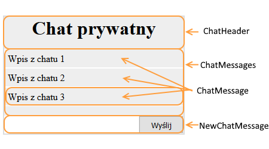

### Zadanie
W pliku js/zadanie02.jsx jest stworzony komponent Chat. Podziel go według tego schematu:

Zadanie wykonaj w dwóch wersjach:

- jako komponent funkcyjny
- jako komponent w wersji zbudowanej z klasy ES6